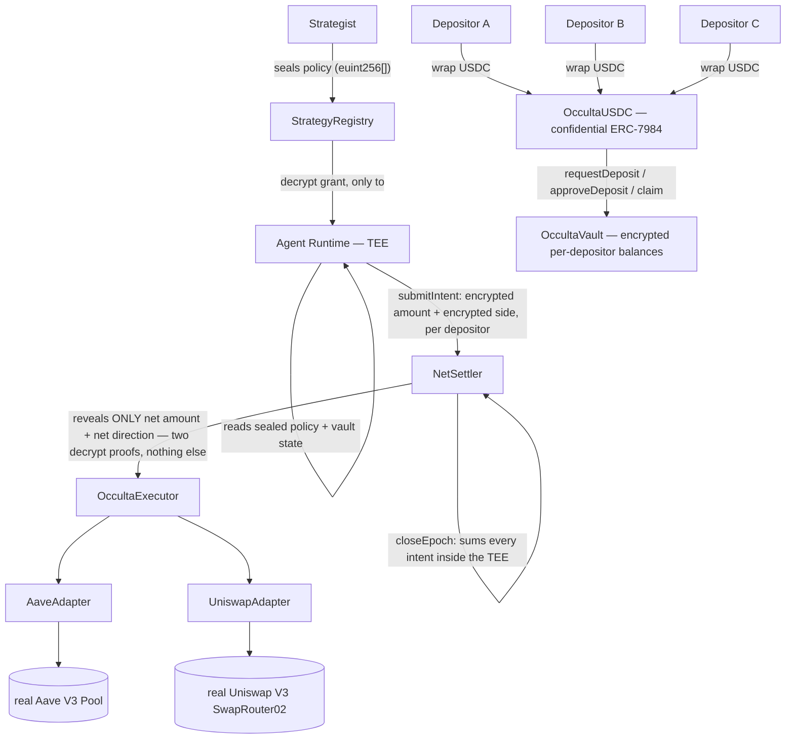

# Occulta

**Confidential DeFi strategy agents on iExec Nox.** A strategist seals a trading policy that
nobody — not depositors, not competitors, not the chain itself — ever gets to read. Depositors
fund a confidential vault. An autonomous agent runs inside a TEE, nets every depositor's position
against everyone else's, and reveals **only the aggregate trade** to the outside world — which it
then executes for real, on unmodified Aave V3 and Uniswap V3.

Nobody sees your balance. Nobody sees your intent. Nobody sees the strategy. The chain only ever
learns one number per epoch: the net order.

**▶ [Watch the 3-minute demo](https://youtu.be/ixvvq1Om5uw)** · **[Live app](https://occulta-nox.vercel.app)** · [Verified contracts on Sepolia ↓](#live-on-sepolia)

## The problem

A public on-chain strategy is a strategy that stops working the moment it's good. Publish your
rebalance logic, your entry/exit triggers, or even just your pending transactions, and you've
handed the alpha to anyone watching the mempool — copy-traded, front-run, or MEV'd before your own
trade lands. This is the one piece of DeFi that "just put it on-chain" has never actually solved:
you can prove a strategy executed correctly without ever proving what it was, but almost nothing
in DeFi is built that way. Vaults expose their positions. Strategies expose their signals.
Depositors expose their size and timing to every other depositor. The thing you can least afford
to leak is exactly the thing on-chain execution normally forces you to leak.

Occulta hides it. Not by moving off-chain — every leg still settles on real, public protocols —
but by making sure the only value that ever crosses into plaintext is a number that, by
construction, cannot be traced back to any single depositor or any single decision.

## How it works



1. **The strategist seals the policy.** `StrategyRegistry.registerAgent` takes an array of
   already-encrypted handles and grants decrypt rights to exactly one address: the named agent
   runtime. The registry itself never gets a second grant — once handed to the runtime, the chain
   forgets the policy.
2. **Depositors fund a confidential vault.** Real Aave-Sepolia USDC wraps 1:1 into `OccultaUSDC`,
   a confidential ERC-7984 token — from that point on, every balance is an encrypted handle, not a
   number in a public mapping. Deposits/redeems follow an EIP-7540-shaped async request → approve
   → claim lifecycle, adapted so the NAV conversion happens under encryption.
3. **The agent nets everyone's intent inside the TEE.** For each epoch, the runtime submits one
   encrypted intent per depositor — size *and side* both encrypted — into `NetSettler`.
   Every intent is folded branchlessly into two running encrypted totals (`buyTotal`, `sellTotal`)
   via `Nox.select`: same opcodes, same gas shape, same trace, regardless of which side an intent
   is on. Nothing about an individual intent is ever compared, sorted, or revealed.
4. **Confidentiality by aggregation.** `closeEpoch` computes `net = |buyTotal − sellTotal|` and
   `direction = buyTotal ≥ sellTotal`, and marks **only those two handles** publicly decryptable —
   never the intents, never their sides, never the two running totals themselves. Publishing a net
   of 30 is safe precisely because it's a sum over an unknown partition: it could be one depositor
   buying 30, or a hundred of them netting to it. A single-intent epoch is the one case that isn't
   safe — see [Honest limits](#honest-limits).
5. **A two-proof settle — never an off-chain number.** `NetSettler.settle` doesn't accept a
   plaintext net from its caller. It calls `Nox.publicDecrypt` **twice** — once for the magnitude,
   once for the direction — each of which re-derives the decryption gateway's signature over
   `(handle, plaintext)` inside NoxCompute. A forged number, a replayed proof from another epoch,
   or an edited payload all fail signature recovery and revert. Only a plaintext the TEE itself
   produced ever reaches execution.
6. **Real execution, no reimplementation.** The proof-verified net is forwarded to
   `OccultaExecutor`, which routes it through `AaveAdapter` / `UniswapAdapter` — thin, owner-gated
   wrappers that make exactly one call each into the genuine, deployed Aave V3 `Pool` and Uniswap
   V3 `SwapRouter02`. Neither protocol is forked, mocked, or modified anywhere in this repo.

## Live on Sepolia

Deployed, wired, and verified on ETH Sepolia (chain id `11155111`):

| Contract | Address |
|---|---|
| StrategyRegistry | [`0x307056cD4800ea5F1E6dA86deA9bAdCe0067bFDc`](https://sepolia.etherscan.io/address/0x307056cD4800ea5F1E6dA86deA9bAdCe0067bFDc#code) |
| OccultaUSDC | [`0x058a10E2D029Ea92c484329BdADcFF9a8122B188`](https://sepolia.etherscan.io/address/0x058a10E2D029Ea92c484329BdADcFF9a8122B188#code) |
| OccultaVaultFactory | [`0x3104242b5A1691649Bb92b6192cd755A5fA0Ba16`](https://sepolia.etherscan.io/address/0x3104242b5A1691649Bb92b6192cd755A5fA0Ba16#code) |
| OccultaVault | [`0xeA1ED96c5c1D089C9203633fF485499C22FEBe9F`](https://sepolia.etherscan.io/address/0xeA1ED96c5c1D089C9203633fF485499C22FEBe9F#code) |
| AaveAdapter | [`0x98b6e2071D092adf54B654Bb72c30B807D539e0D`](https://sepolia.etherscan.io/address/0x98b6e2071D092adf54B654Bb72c30B807D539e0D#code) |
| UniswapAdapter | [`0xE4E50a8fE8E1E0963b4BA9F8f8B39458972E59cA`](https://sepolia.etherscan.io/address/0xE4E50a8fE8E1E0963b4BA9F8f8B39458972E59cA#code) |
| OccultaExecutor | [`0xBA3A8E6Cba95a7bAAb0BcdB8E6Fb1A4143249831`](https://sepolia.etherscan.io/address/0xBA3A8E6Cba95a7bAAb0BcdB8E6Fb1A4143249831#code) |
| NetSettler | [`0x8BB7CF578cc1953430e64B1d08A68fEA17e14Feb`](https://sepolia.etherscan.io/address/0x8BB7CF578cc1953430e64B1d08A68fEA17e14Feb#code) |
| Uniswap V3 pool (seeded, USDC/WETH 1%) | [`0x264B8FB8D89c401cACe37F9501dd072bf35a2E0d`](https://sepolia.etherscan.io/address/0x264B8FB8D89c401cACe37F9501dd072bf35a2E0d#code) |

### The proof run

One live run against real Sepolia, zero reverts, start to finish: a depositor funded the vault
with 50 USDC, three encrypted trading intents were submitted into one epoch (**buy 20**, **buy
15**, **sell 5**), and closing the epoch revealed exactly one number to the outside world:

> **Net: 30 USDC, BUY** — the epoch never disclosed the three intents that produced it.

Before the epoch closed, the "buy 20" intent's handle was checked live against the deployed
contracts and the real Nox gateway: `isPubliclyDecryptable` returned `false` on both its amount
and its side, and calling `publicDecrypt` on it directly was rejected by the gateway — the
individual intent is provably unreadable by anyone outside the settler and the runtime.

Settling that epoch executed real DeFi, in the same transaction:

| | |
|---|---|
| Uniswap V3 swap | **30 USDC → 0.009764942720128096 WETH** |
| Aave V3 collateral | **$0.00 → $39.05977088** (`totalCollateralBase`, 8-decimal USD base) |
| Aave health factor after | `type(uint256).max` — Aave's own zero-debt convention |
| Transactions | 14, all `status: success`, zero reverts |

Key transactions, on-chain:

- [`registerAgent`](https://sepolia.etherscan.io/tx/0x2f90fd5ff4b822e4a1c00eacc0b75a3ad37284028347f1a19773b8eb87ad7046) — the sealed policy, submitted through the live Nox gateway
- [`submitIntent: buy 20 USDC`](https://sepolia.etherscan.io/tx/0x3394d45e8f6182b2b5070ca3d99eea0b4b5f763647f5db606bcefe91e85af034) — one of the three intents that stay sealed forever
- [`closeEpoch`](https://sepolia.etherscan.io/tx/0xa260e1dc2da6000b9dd3940a85be13cf5205294784905c8e1bfd72b4b7af1bc4) — nets the epoch, reveals only the aggregate
- [`settle`](https://sepolia.etherscan.io/tx/0xa7509b8f5c516f36683aa58d3079370c4f4995f7461d8b62abbcba303f2a5653) — two-proof verified net → real Uniswap swap + real Aave supply, one transaction

## What's real / no mocks

Every leg of the settlement path hits a genuinely deployed protocol — nothing in the execution
path is a fork or a reimplementation:

- **Aave V3** — `AaveAdapter` calls the real, unmodified Sepolia `Pool` (`supply` / `withdraw` /
  `borrow` / `repay`), with nothing between the adapter and the Pool but an `approve`.
- **Uniswap V3** — `UniswapAdapter` calls the real `SwapRouter02.exactInputSingle` against a real,
  seeded USDC/WETH 1% pool, quoted live via the real `QuoterV2` before every swap.
- **Confidential compute** — every encrypted operation (`Nox.select`, `Nox.add`, `Nox.safeSub`,
  `Nox.publicDecrypt`, ...) runs against the live Nox gateway and NoxCompute on Sepolia, not a
  local simulator.

Mocks (`MockUSDC`, `MockExecutionTarget`) exist only inside the unit-test suite, for isolating
contract logic from network state — nothing on the deployed, demoed, or fork-tested paths is
mocked.

## Run it

```bash
pnpm install
```

- **`pnpm hardhat test`** — 47 unit tests against a local, Dockerized Nox stack (KMS, gateway,
  runner, ingestor) that the Hardhat plugin spins up automatically. **Requires Docker running.**
- **`pnpm test:fork`** — integration tests against a Sepolia fork, exercising the real deployed
  Aave V3 Pool and Uniswap V3 router/quoter code (no mocks). Requires `SEPOLIA_RPC_URL` in `.env`.
- **`pnpm demo:sepolia`** — runs the live end-to-end demo above against real Sepolia. Requires a
  funded Sepolia key and a `.env` (copy `.env.example`, fill in `SEPOLIA_RPC_URL` and
  `DEPLOYER_PRIVATE_KEY`/`DEPLOYER_ADDRESS`).
- **`pnpm deploy:sepolia`** / **`pnpm seed:sepolia`** — deploy the full stack fresh, or re-seed the
  Uniswap pool.

## Honest limits

- **Aggregation only protects a batch, not a singleton.** If an epoch closes with exactly one
  intent in it, the revealed net *is* that depositor's order — there's no crowd to hide in. The
  guarantee holds only as long as the runtime batches multiple intents per epoch, and that
  batching is a property of how the runtime is operated, not something this contract can enforce
  on-chain.
- **The runtime sees everything, by design.** The privacy guarantee is against *everyone except*
  the attested agent runtime — the runtime itself holds decrypt access to every depositor's
  balance and every raw intent, because it has to in order to compute the net. That guarantee is
  only as strong as the TEE attestation backing the runtime's key.
- **The vault→executor bridge is demonstrated, not fully wired on-chain.** In this deployment
  shape, moving a netted aggregate from the confidential vault's assets into the executor's
  plaintext balance is shown by pre-funding the executor directly (see `OccultaExecutor.sol`'s own
  header and `scripts/demo.ts`), rather than by an on-chain unwrap call in the settlement path
  itself.
- **Runtime-key rotation is additive, not revocable.** `StrategyRegistry.setRuntime` can hand a
  new runtime decrypt rights on every policy slot, but it cannot strip them from the old one — the
  underlying Nox ACL has no persistent revoke, only `allow`. A rotated-out key keeps read access to
  everything it was already granted.
- **Deposit/redeem events are not anonymous.** Only *amounts* are sealed — `DepositRequest`,
  `RedeemRequest`, and the claim events all index the depositor's address and block timestamp in
  plaintext, so who deposited and when is public even though how much is not.

## Tech stack

Solidity 0.8.35 · [iExec Nox](https://www.iex.ec/) (`@iexec-nox/nox-protocol-contracts`,
`@iexec-nox/nox-confidential-contracts`, `@iexec-nox/nox-hardhat-plugin`, `@iexec-nox/handle`) ·
ERC-7984 confidential token standard · EIP-7540 async vault shape, adapted for encrypted amounts ·
Hardhat 3 + viem · OpenZeppelin Contracts 5.6 · Aave V3 · Uniswap V3 (SwapRouter02 + QuoterV2) ·
Docker (local Nox offchain stack).

---

Building on Nox surfaced some sharp edges worth sharing — see [`feedback.md`](./feedback.md) for
specific, reproducible developer feedback on the tooling.

MIT licensed — see [`LICENSE`](./LICENSE).
